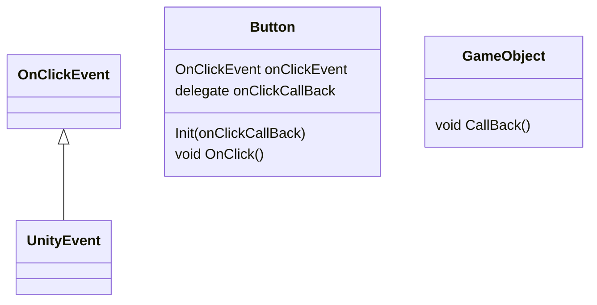
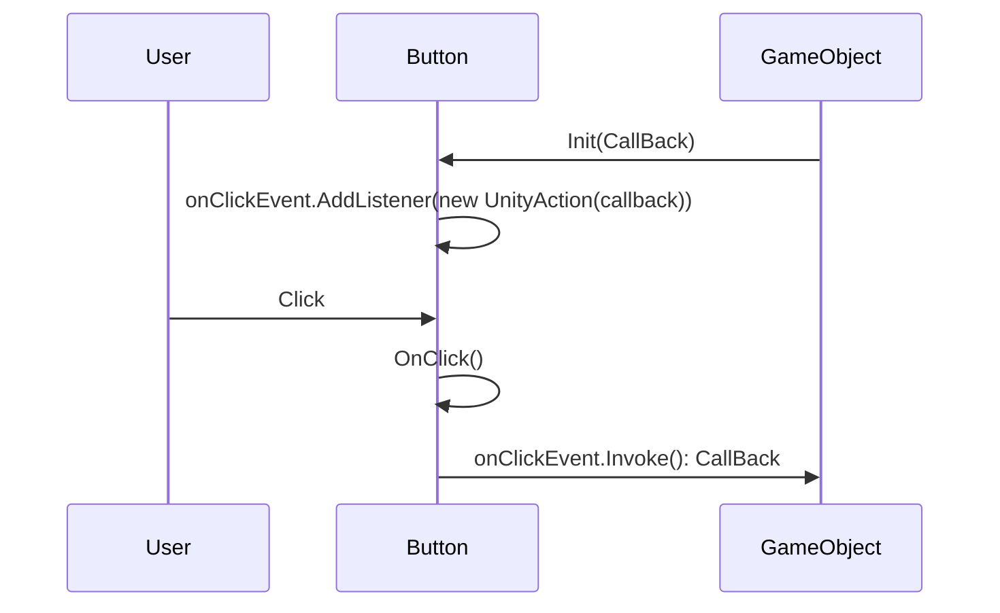

# Button Event

## class

```mermaid

classDiagram
    OnClickEvent <|-- UnityEvent

    class Button{
        OnClickEvent onClickEvent
        delegate onClickCallBack
        Init(onClickCallBack)
        void OnClick()
    }

    class GameObject{
        void CallBack()
    }

```

## sequence

```mermaid
sequenceDiagram
    participant User
    participant Button
    participant GameObject

    GameObject->>Button: Init(CallBack)
    Button->>Button: onClickEvent.AddListener(new UnityAction(callback))
    User->>Button: Click
    Button->>Button: OnClick()
    Button->>GameObject: onClickEvent.Invoke(): CallBack
```
